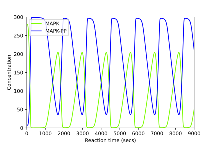
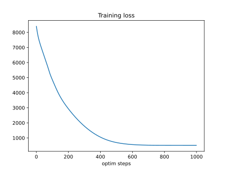

# Should you use SBMLtoODEjax?

## 👍 Advantages

### Ease of use

With only few lines of python code, SBMLtoODEjax allows you to load and simulate existing SBML files.
For instance, if one wants to reproduce simulation results from [this model](https://www.ebi.ac.uk/biomodels/BIOMD0000000010#Curation)
hosted on the BioModels website, one simply needs to implement the following:

<div style="display: flex; align-items: center;">

```python
from sbmltoodejax.utils import load_biomodel

# load and simulate model 
model, _, _, _ = load_biomodel(10)
n_secs = 150*60
n_steps = int(n_secs / model.deltaT)
ys, ws, ts = model(n_steps)

# plot time-course simulation
...
```


</div>

You can check our [Numerical Simulation](tutorials/biomodels_curation.ipynb) tutorial to reproduce results yourself and see more examples.

### Flexibility
With the SBMLtoODEjax conventions and [Design Principles](design_principles.md), one can easily manipulate the model's variables and parameters,
whether they are species initial or dynamical states, reaction kinematic or constant parameters, or even ODE-solver hyperparameters.

Those parameters can not only be easily manipulated by hand but also explored with more advanced automatic techniques that are facilitated by JAX 
automatic vectorization and/or differentiation (see below).

### Just-in-time compilation
`jit` compilation is one of the core function transformations in JAX. 
When a JIT-compiled function is called for the first time, JAX generates an optimized representation of the function called a trace such that 
subsequent calls to the function use this compiled trace, resulting in improved performance.

JAX allows us to efficiently execute model rollouts by using the `jit` transformation over the *ModelStep* function and by using the `scan` primitive to reduce compilation time of 
for-loop calling of the JIT-compiled function. Basically, the models generated by SBMLtoODEjax are implemented as below: 

```python
class ModelRollout(eqx.Module):
    
    def __call__(self, n_steps, y0, w0, c, t0=0.0):

        @jit # use of jit transformation decorator
        def f(carry, x):
            y, w, c, t = carry
            return self.modelstepfunc(y, w, c, t, self.deltaT), (y, w, t)
        
        # use of scan primitive to replace for loop (and reduce compilation time)
        (y, w, c, t), (ys, ws, ts) = lax.scan(f, (y0, w0, c, t0), jnp.arange(n_steps)) 
        ys = jnp.moveaxis(ys, 0, -1)
        ws = jnp.moveaxis(ws, 0, -1)
        
        return ys, ws, ts
```

Below we compare the average simulation time of model rollouts, on the same machine and for different rollout lengths (reaction times), 
for models generated with the original SBMLtoODEpy library (shown in pink) versus with the SBMLtoODEjax library (shown in blue):


We can see that for short reaction times (here <100 secs with $\Delta T=0.1$, see Log Scale), SBMLtoODEjax simulation takes longer than the original SBMLtoODEpy
library because when calling *ModelStep* for the first time, it takes some time to generate the compiled trace.
However, the advantage of SBMLtoODEjax becomes clear when considering longer rollouts where we obtain huge speed-ups with respect to original SBMLtoODEpy library (see Linear Scale).
This is because the original SBMLtoODEpy python code uses for-loops, hence have linear increase of compute time, whereas the scanned JIT-compiled step function executes much faster.
You can check our [Benchmarking](tutorials/benchmark.ipynb) tutorial for more details on the comparison.

### Automatic vectorization
`vmap` is another core function transformations in JAX which enables efficient (and seamless) vectorization of functions.
Here, it is particularly useful for running simulation in parallel with batched computations such as batch of initial conditions.
As shown below, doing this in JAX is very simple as one simply need to use `vmap` transformation to vectorize the model function and then call the batched model in the exact same way:

```python
# vector of initial conditions
batched_y0 = ...

# batch model
batched_model = vmap(model, in_axes=(None, 0), out_axes=(0, 0, None))

# run simulation in batch mode
batched_ys, batched_ws, ts = batched_model(n_steps, batched_y0)
```

Below we compare the average simulation time of model rollouts for 1) the SBMLtoODEpy-generated models and for loop computations over the inputs (pink), 2) the SBMLtoODEpy-generated models and pooling over the inputs (orange) 
and 3) the SBMLtoODEjax library with vectorized computations (blue). We show results for different batch sizes (x-axis), where all runs have been done on the same machine and for 
a rollout length of 10 seconds with $\Delta T=0.1$.


Again, similar conclusions can be drawn where SBMLtoODEjax is less efficient for small batch sizes (and small rollout lengths), but becomes very advantageous
for larger batch sizes. 
You can check our [Benchmarking](tutorials/benchmark.ipynb) tutorial for more details on the comparison.


### Automatic differentiation
Finally, `grad` is another core function transformations in JAX which enables automatic differentiation
and allows seamless integration of SBMLtoODEjax models with [Optax](https://optax.readthedocs.io/en/latest/) pipelines, a gradient processing and optimization library for JAX. 
Whereas Optax has typically been used to optimize parameters of neural networks, we can use it in the very same way to optimize parameters of our SBMLtoODEjax models 
as shown below:

<div style="display: flex; align-items: center;">

```python
# Load Model
model, y0, w0, c = load_model(model_idx)

# Optax pipeline
@jit
def loss_fn(c, model): 
    """loss function"""
    ys, ws, ts = model(n_steps, y0, w0, c)
    loss = jnp.sqrt(jnp.square(ys[y_indexes["Ca_Cyt"]]
                               -target_Ca_Cyt).sum())
    return loss

@jit
def make_step(c, model, opt_state):
    """update function"""
    loss, grads = value_and_grad(loss_fn)(c, model)
    updates, opt_state = optim.update(grads, opt_state)
    c = optax.apply_updates(c, updates)
    return loss, c, opt_state

n_optim_steps = 1000
optim = optax.adam(1e-3)
opt_state = optim.init(c)
train_loss = []
for optim_step_idx in range(n_optim_steps):
    loss, c, opt_state = make_step(c, model, opt_state)
    train_loss.append(loss)

# Plot train loss
plt.plot(train_loss)
plt.ylabel("training loss")
plt.xlabel("train steps")
plt.show()
```
<div style="display: flex; flex-direction: column;" width="250px">



</div>
</div>

In the above example, we show how we can use optax pipeline to optimize the kinematic parameters of the [biomodel #145](https://www.ebi.ac.uk/biomodels/BIOMD0000000145) to have it follows a target pattern 
of calcium ions oscillations. We show the resulting behavior before and after optimization, and see that optimization successfully found parameters $c$ leading to calcium oscillations
close to target patterns (while not perfectly matching).
Please check our [Gradient Descent](tutorials/gradient_descent.ipynb) tutorial for walkthrough of the optimization procedure, as well as more-advanced interventions by optimizing 
temporally regulated patterns of stimuli on specific nodes (instead of modifying the network weights).

To our knowledge, this is the first software tool that allows to perform automatic differentiation 
and gradient-descent based optimization of SBML models parameters and/or dynamical states.
However, as detailed in the tutorial, gradient descent can also be quite hard in the considered biological systems and other optimization methods (like evolutionary algorithms)
might be more adapted.


## 👎 Limitations


### JAX can be hard
For people that are new to JAX and/or to the functional programming style, understanding the design choices made in SBMLtoODEjax can (maybe) get quite confusing. 

Whereas there is no need of deep understanding of the underlying principles for basic usages of the SBMLtoODEjax library such as
[Numerical Simulation](tutorials/biomodels_curation.ipynb) and [Parallel Execution](tutorials/parallel_execution.ipynb), things can get more complicated
for more advanced usages such as [Gradient-descent optimization](tutorials/gradient_descent.ipynb) and custom interventions on the biological model 
structure and/or dynamics.

:::{seealso}
For people that are not familiar with JAX but that want to give it a try, the main constraints of programming in JAX 
are well-summarized in their documentation [🔪 JAX - The Sharp Bits 🔪](https://jax.readthedocs.io/en/latest/notebooks/Common_Gotchas_in_JAX.html).
Be sure to check it before starting to write your code in JAX, as they are the main things that can make your programming and/or debugging experience harder.
:::

### Does not (yet) handle several cases 
SBMLtoODEjax is still in its early phase so they are several limitations to it at the moment.
In particular, they are several error cases that are not handled by the current simulator including:
* Events: SBML files with events (discrete occurrences that can trigger discontinuous changes in the model) are not handled
* Custom Functions: we handle a large portion of functions possibly-used in SBML files (see `mathFuncs` in `sbmltoodejax.modulegeneration.GenerateModel`), but not all 
* Custom solvers: To integrate the model's equation, we use jax experimental `odeint` solver but do not yet allow for other solvers.
* NaN/Negative values: numerical simulation sometimes leads to NaN values (or negative values for the species amounts) which could either be due to wrong parsing or solver issues

This means that a large portion of the possible SBML files cannot yet be simulated, for instance as we detail on the below image, out of 1048
curated models that one can load from the BioModels website, only 232 can successfully be simulated (given the default initial conditions) in SBMLtoODEjax.


👉 Those limitations should be resolvable and will hopefully be fixed in future versions. 
Please consider contributing and check our [Contribution Guidelines](contributing.md) to do so!