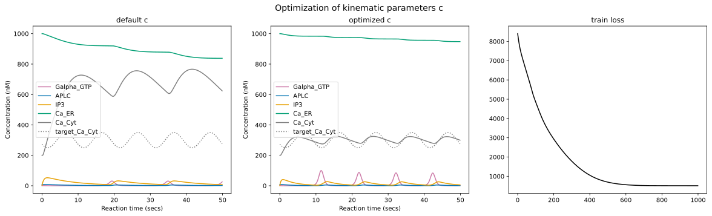

# Should you use SBMLtoODEjax?

## 👍 Why you should

### Ease of use

With only few lines of python code, SBMLtoODEjax allows you to load and simulate existing SBML files.
Go check our [Numerical Simulation](tutorials/biomodels_curation.ipynb) tutorial to see how easy it is to reproduce numerical simulations from papers/models hosted 
on the BioModels website like the one below:

### Flexibility
With the SBMLtoODEjax conventions and [Design Principles](design_principles.md), one can easily manipulate the model's variables and parameters,
whether they are species initial or dynamical states, reaction kinematic or constant parameters, or even ODE-solver hyperparameters.

Those parameters can not only be easily manipulated by hand but also explored with more advanced automatic techniques that are facilitated by JAX 
automatic vectorization and/or differentiation (see below).

### Just-in-time compilation
`jit` compilation is one of the core function transformations in JAX. 
When a JIT-compiled function is called for the first time, JAX traces the function's execution and generates an optimized representation called a trace such that 
subsequent calls to the function use this compiled trace, resulting in improved performance.

JIT allows us to efficiently execute model rollouts by jitting the *ModelStep* function which is called at each time step.
Below we compare the average simulation time of model rollouts, on the same machine and for different rollout lengths, run with the SBMLtoODEpy library  (shown in pink) versus with
the SBMLtoODEjax library that makes advantage of just-in-time compilation (shown in blue).
We can see that for short reaction times (< 100 secs), the compute time is very fast for both simulator (<<1 sec) and even faster with the original SBMLtoODEpy (see Log Scale).
Here SBMLtoODEjax is less efficient because when calling *ModelStep* for the first time, it takes some time to generate the compiled trace.
However, the advantage of using JAX becomes obvious when considering longer rollouts (>100 secs) where we obtain huge speed-ups with respect to original python for-loops 
with linear compute time increase.

You can check our [Benchmarking](tutorials/benchmark.ipynb) tutorial for more details on the comparison.

### Automatic vectorization
`vmap` is another core function transformations in JAX.  
It enables efficient (and seamless) vectorization of functions which is particularly useful when working with batched computations such as batch of initial conditions.

Below we compare the average simulation time of model rollouts, for a rollout length of 10 seconds on the same machine and for different batch sizes, run with the SBMLtoODEpy library and for loop 
over the batched inputs (shown in pink), with the SBMLtoODEpy library and pooling over the batched inputs (shown in orange) and finally with
the SBMLtoODEjax library and jit+vmap (shown in blue). 
Again, similar conclusions can be drawn: for small batch sizes (and a rollout length of 10 seconds) SBMLtoODEjax is not the more efficient however its advantage becomes
clear for larger batch sizes.

You can check our [Benchmarking](tutorials/benchmark.ipynb) tutorial for more details on the comparison.

### Automatic differentiation
Finally, `grad` is another core function transformations in JAX. 
It enables automatic differentiation which allow to do more advanced manipulations using techniques like gradient descent.

Below we show an example use case where we use gradient descent to optimize one model's parameters to have it follows a target pattern 
of calcium ions oscillations.

However gradient descent can be quite hard in the considered biological systems for several reasons, 
you can check our [Gradient Descent](tutorials/gradient_descent.ipynb) tutorial for more informations.

## 👎 Why you should NOT

### JAX can be hard
For people that are new to JAX and/or to the functional programming style, understanding the design choices made in SBMLtoODEjax can (maybe) get quite confusing. 

Whereas there is no need of deep understanding of the underlying principles for basic usages of the SBMLtoODEjax library such as
[Numerical Simulation](tutorials/biomodels_curation.ipynb) and [Parallel Execution](tutorials/parallel_execution.ipynb), things can get more complicated
for more advanced usages such as [Gradient-descent optimization](tutorials/gradient_descent.ipynb) and custom interventions on the biological model 
structure and/or dynamics.

:::{seealso}
For people that are not familiar with JAX but that want to give it a try, the main constraints of programming in JAX 
are well-summarized in their documentation [🔪 JAX - The Sharp Bits 🔪](https://jax.readthedocs.io/en/latest/notebooks/Common_Gotchas_in_JAX.html).
Be sure to check it before starting to write your code in JAX, as they are the main things that can make your programming and/or debugging experience harder.
:::

### Does not (yet) handle several cases 
SBMLtoODEjax is a lightweight library that is still in its early phase so they are several limitations to it at the moment.
In particular, they error several error cases that are not handled by the current simulator including:
* Events: SBML files with events (discrete occurrences that can trigger discontinuous changes in the model) are not handled
* Custom Functions: we handle a large portion of functions possibly-used in SBML files (see `mathFuncs` in `sbmltoodejax.modulegeneration.GenerateModel`), but not all 
* Custom solvers: To integrate the model's equation, we use jax experimental `odeint` solver but do not yet allow for other solvers.
* NaN/Negative values: numerical simulation sometimes leads to NaN values (or negative values for the species amounts) which could either be due to wrong parsing or solver issues

This means that a large portion of the possible SBML files cannot yet be simulated, for instance as we detail on the below image, out of 1048
curated models that one can load from the BioModels website, only 232 can successfully be simulated (given the default initial conditions) in SBMLtoODEjax.

👉 Those limitations should be resolvable and will hopefully be fixed in future versions. 
Please consider contributing and check our [Contribution Guidelines](contributing.md) to do so!